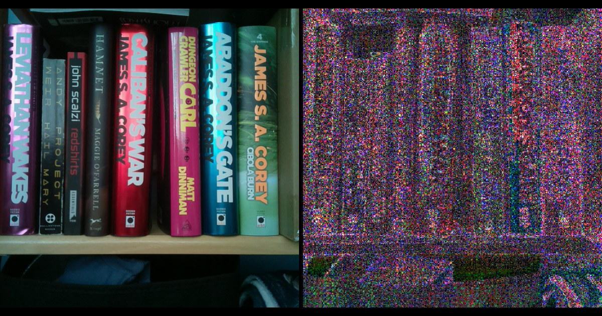

# SeedSigner AI Analysis

AI-assisted analyses of SeedSigner's critical subsystems, published for transparency.



**Live:** <https://kdmukai-bot.github.io/seedsigner-ai-analysis/> — deployed to GitHub Pages
from `main` via `.github/workflows/pages.yml`. The documents are standalone HTML with no build
step, so a local clone renders identically by opening `index.html` in a browser.

These are **analyses, not audits.** No independent engagement, no certification. They are
produced by SeedSigner's lead developer using AI tooling, and published because "trust us" is a
poor answer to questions about how a Bitcoin wallet generates keys. They are individual work, not
an official SeedSigner project publication. Every claim is pinned to a source
line or a measurement, and every document records what it could not verify.

## Contents

| Analysis | Subject | Reviewed | Status |
|---|---|---|---|
| [`image-entropy/`](image-entropy/) | Turning a photograph into a seed phrase | 0.8.7 | Published |
| [`dice/`](dice/) | SeedSigner's dice path, and every release since 2020 | 0.8.7 | Published |
| [`dice/standard.html`](dice/standard.html) | Every dice-to-seed method Bitcoin wallets use | 17 implementations | Published |
| [`word-picking/`](word-picking/) | Building a seed by drawing BIP-39 words | — | Work in progress |

The dice pair is one subject in two documents: `dice/standard.html` is the cross-ecosystem
reference, covering five methods and which implementation uses which, and `dice/index.html` is the
SeedSigner analysis that checks its own path against that standard. `word-picking/` is published
deliberately incomplete and says so at the top.

Format and evidentiary rules: **[CONVENTIONS.md](CONVENTIONS.md)**.

The image-entropy documents and data have been through an independent adversarial review pass
(three fresh-context reviewers: figure recomputation, claims and logic, source verification at
the pinned tags). The pass and everything it changed are recorded in the document's *Scope and
provenance* section.

## Layout

```
assets/          fonts.css (SS Sans / SS Mono) + series.css — shared, cached across documents
index.html       series landing page
CONVENTIONS.md   document structure, evidentiary rules, deployment reality
<analysis>/
  index.html     the document (image-entropy also has evidence.html, the AI-first half;
                 dice also has standard.html, the cross-ecosystem reference)
  figures/       plates, as files
  evidence/      supporting detail behind the published claims
  dataN/         raw measurement inputs by capture round, each with a RUNS.md manifest
  capture-rig/   provenance-gated instrumented-build rig: build script, verifier, patch
  *.py           the scripts that produced the figures and numbers
```

Documents are standalone HTML with no build step. Regenerating figures or recomputing
measurements uses the scripts in each analysis directory.

## Reproducing the image-entropy measurements

Everything below is the **shipping v0.8.7 path**: picamera/MMAL, the exact bytes v0.8.7 feeds
into its SHA-256 chain, dumped before hashing by upstream-pinned instrumented builds. The
retained population is `image-entropy/data1/` through `data5/` (32 runs, 4 devices, ~340 MB of
raw frames), each directory carrying a `RUNS.md` manifest with its conditions, provenance and
figures.

```bash
cd image-entropy
python3 analyze_mcv.py                 # final images: min-entropy, worst of all 45 pairs, every series
python3 analyze_preview.py data3/burst-19700101-000150-6b66   # preview window structure, per run
python3 analyze_review_screen.py       # what the review screen would have displayed, per frame
python3 analyze_burst.py               # compressed-difference estimator (ceiling-side; no headline figure uses it)
python3 make_figures_lit.py            # regenerate the bookshelf plates + social card
python3 make_figures_whitewall.py      # regenerate the blank-wall plates
python3 make_figures_dark150.py        # regenerate the dark plates (Pillow 11.0.0; see docstring)
```

```python
img = np.fromfile(path, dtype=np.uint8).reshape(480, 480, 3)   # 640 for Plus-display stills
```

Each run ships its on-device `capture.log` (board, unit id, requested resolution, per-frame byte
length, inter-frame gap, auto-exposure state, and a SHA-256 digest for every preview-window
slot). Validity is asserted before any statistic is reported: final-image series refuse
duplicate frames, while the preview analyzer reports duplicates as the finding they are. The
build, capture and validation procedure is
[`image-entropy/capture-rig/`](image-entropy/capture-rig/README.md).

## Corrections

Corrections and challenges are welcome, particularly on the measurements. The raw data ships
with the analyses so disagreements can be settled with numbers. Open an issue.

If you are directing an AI to review this project, read the deployment-reality section of
[CONVENTIONS.md](CONVENTIONS.md) first. Reviewers have repeatedly produced confident findings
that do not apply to air-gapped hardware with no wireless and no persistent filesystem.

## Scope

Each analysis covers **one subsystem**. None of them is a whole-product audit and none should be
read as one.

Work covering unfixed defects is **not** published here. It stays in a private working directory
until disclosure is resolved.

## Attribution

Produced with Anthropic's Claude models. Per-document model attribution, method, and correction
history are recorded in each analysis under *Scope and provenance*.

Typography is `SS Sans` and `SS Mono`, embedded in `assets/fonts.css`.
